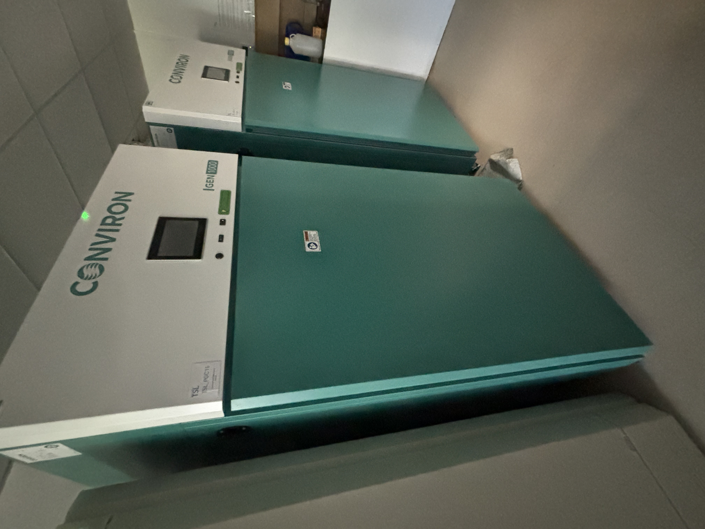
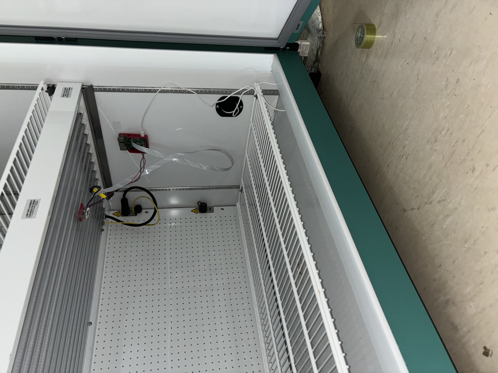

# Image Collection

2024-07-10

### Purpose:  

It is important that the steps taken to collect the images for the
training dataset are clearly outlined. Any experimental procedure is
likely to ingrain some bias within the dataset as a consequence of its
design. In its documentation, these biases can later be idenitified and
accounted/compensated for.  

### Setting up the camera inside the incubator: 

This is the incubator Simon Foster allowed me to use:  
  

I used cellotape to temporarily fix the RPi board to the side so that it
is beyond the camera’s field of view, the camera secured to the top
looking down.  
  

### Using timelapser: 

Any appropriate image capture rate for the timelapse would work. As an
example:  

``` {bash}
#| eval: false

cd path/to/timelapser
source camera/bin/activate 
sudo camera/bin/python3 scripts/start_timelapse.py --units h --duration 1 --samples 120 --path path/to/desired/image/output/directory
```

This script starts a timelapse for 1 hour, taking an image every 30
seconds.  

Standard output stream (not a screenshot… apologies):  
  

This results in images like this:  
  

### Next step: Crop images down into equally sized composite images, as shown [here](images/downsized/) using the example image.
